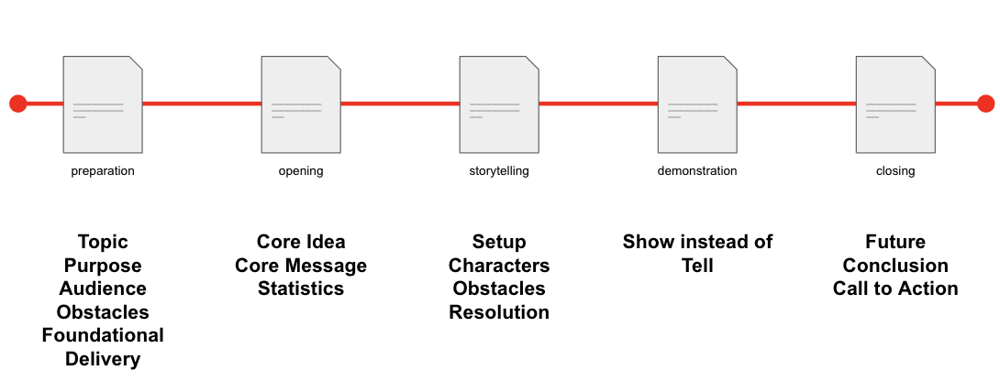

.. Storytelling Framework documentation master file, created by
   sphinx-quickstart on Wed Oct  5 09:40:26 2022.
   You can adapt this file completely to your liking, but it should at least
   contain the root `toctree` directive.

Welcome to Storytelling Framework's documentation!
==================================================

.. image:: Storytelling_Framework.png 

Contents
--------
.. toctree::
   preparation
   opening
   storytelling
   demonstration
   closing 

Indices and tables
==================

* :ref:`genindex`
* :ref:`modindex`
* :ref:`search`

